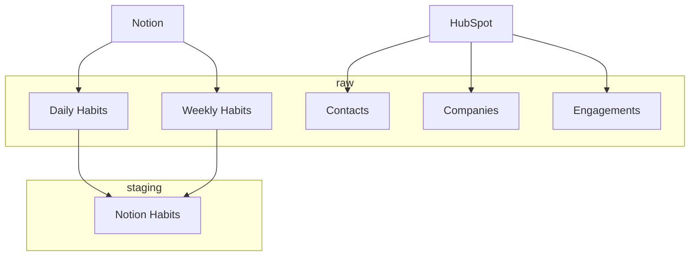

# personal-reporting-airflow

Airflow server for personal data integration and experimentation.

## Overview

This repository contains a Docker Development Container for VSCode and the infrastructure and workflows for my personal airflow instance. It has been deployed as a Python 3.12 application to Azure App Service on a relatively small instance with a small PostgreSQL metadatabase.

## Data Sources

The following data will be ingested from my personal systems into a BigQuery warehouse for automation and analysis.

1. Notion
2. HubSpot
3. Google Contacts

### Warehouse Data Flow

## Frameworks

1. [Alembic](https://alembic.sqlalchemy.org/en/latest/) database migrations for raw tables which should generally match the schema of the source system, run via [Airflow provider package](https://pypi.org/project/airflow-provider-alembic/)
2. [Airflow](https://airflow.apache.org/) to orchestrate data loading scripts and additional automated workflows
3. [DBT core](https://docs.getdbt.com/) to define data models and transformations, again orchestrated by Airflow (via CLI / `BashOperator`) 

## Setup

### Airflow Setup

While it generally isn't recommended to maintain infrastructure and workflows in the same repository, it is not a major concern for this basic setup. Currently there are no custom plugins or updates to configuration via `airflow.cfg` or `webserver_config.py` (just via environment variables), so only the `DAGS_FOLDER` is mapped to the application code and configurations are loaded from the default `AIRFLOW_HOME`.

To run Airflow on a single instance, I used Honcho to run multiple processes via Procfile (webserver + scheduler)

### Azure Setup

1. Create Web App + PostgreSQL with Python
2. Turn on Application Insights, Logging
3. Set relevant environment variables for Airflow
    - `AIRFLOW_HOME=/home/site/wwwroot` to run airflow from deployed application folders
    - `AIRFLOW__DATABASE__SQL_ALCHEMY_CONN=postgresql+psycopg2://{username}:{password}@{host}:{port}/{database}` from the Azure database
    - `AIRFLOW__API__AUTH_BACKENDS=airflow.api.auth.backend.basic_auth, airflow.api.auth.backend.session` for authorization
    - `AIRFLOW__CORE__EXECUTOR=LocalExecutor` to allow parallel execution on a single instance
    - `AIRFLOW__CORE__FERNKET_KEY={generated-key}` following [this guidance](https://airflow.apache.org/docs/apache-airflow/1.10.8/howto/secure-connections.html) to encrypt connection data
    - `AIRFLOW__WEBSERVER__WEB_SERVER_MASTER_TIMEOUT=600` to allow for longer startup
4. Generate Publish Profile file and deploy application code from GitHub
5. Set startup command to use the `startup.txt` file
6. Run database migrations (`airflow db migrate`) and user setup (`airflow users create`) as one-off admin process, Procfile just for main processes
    - Reference [quick start](https://airflow.apache.org/docs/apache-airflow/stable/start.html) for guidance on this setup process
    - It may be necessary to run these via startup command to get the app to launch 

### Automated Deployment

1. I referenced [this workflow](https://learn.microsoft.com/en-us/azure/app-service/deploy-github-actions?tabs=applevel%2Cpython%2Cpythonn) to deploy Python app to App Service using Publish Profile basic authentication

### Integrations

1. Google Cloud BigQuery using [Airflow BigQuery Provider](https://airflow.apache.org/docs/apache-airflow-providers-google/stable/operators/cloud/bigquery.html#upsert-table)
2. Notion using [Notion Client](https://pypi.org/project/notion-client/)

## Testing

### Environments

Unit testing and the local instance are connected to a separate Google Cloud Platform project for development purposes.

### Setup Steps

1. Build Dev Container in VSCode, this will run `script/setup` to install dependencies (with dev)
2. To run server locally, run `honcho start` in the terminal
3. Add connection settings in the interface or upload via file
4. Write and run [unit tests for DAGs](https://airflow.apache.org/docs/apache-airflow/stable/best-practices.html#unit-tests)