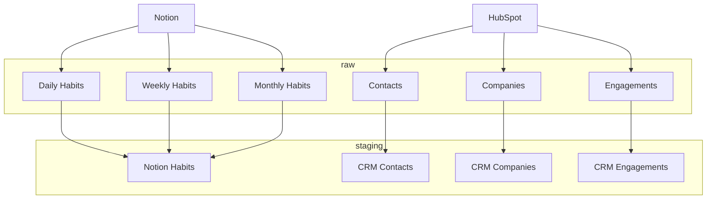

# personal-reporting-pipelines

#### Development and Documentation
#### Development and Documentation

[](https://deepwiki.com/michaelconan/personal-reporting-pipelines)
[](https://codecov.io/gh/michaelconan/personal-reporting-pipelines)

[](https://github.com/michaelconan/personal-reporting-pipelines/actions/workflows/test-pipelines.yml)
[](https://github.com/michaelconan/personal-reporting-pipelines/actions/workflows/test-transforms.yml)
[](https://github.com/michaelconan/personal-reporting-pipelines/actions/workflows/docs.yml)

#### Data Refresh Workflows
#### Data Refresh Workflows

[](https://github.com/michaelconan/personal-reporting-pipelines/actions/workflows/refresh-hubspot.yml)
[](https://github.com/michaelconan/personal-reporting-pipelines/actions/workflows/refresh-fitbit.yml)
[](https://github.com/michaelconan/personal-reporting-pipelines/actions/workflows/refresh-notion.yml)

[](https://github.com/michaelconan/personal-reporting-pipelines/actions/workflows/run-transforms.yml)

[](https://github.com/michaelconan/personal-reporting-pipelines/actions/workflows/run-transforms.yml)

Personal data integration and analytics platform using dlt and dbt against BigQuery, orchestrated with GitHub Actions.

## Overview

This repository contains a Docker Development Container for VSCode and the infrastructure and workflows for my personal data platform. It leverages Google Cloud Platform services including BigQuery for data warehousing and Secret Manager for secure credential management, with automated orchestration through GitHub Actions.

## Data Sources

The following data will be ingested from my personal systems into a BigQuery warehouse for automation and analysis.

1. Notion
2. HubSpot
3. Fitbit

### Warehouse Data Flow



## Architecture

### Data Pipeline Stack

1. **[dlt hub](https://dlthub.com/docs/intro)** - Extract, load, and transform source data into BigQuery raw layer
2. **[dbt core](https://docs.getdbt.com/)** - Transform raw data into analytics-ready models and views
3. **[BigQuery](https://cloud.google.com/bigquery)** - Cloud data warehouse for storage and analysis
4. **[GCP Secret Manager](https://cloud.google.com/secret-manager)** - Secure credential management for API keys and connections
5. **[GitHub Actions](https://github.com/features/actions)** - Automated orchestration and scheduling of data pipelines

### Project Structure

The project follows modern data engineering best practices with clear separation of concerns:

```
├── pipelines/          # dlt data extraction pipelines
├── pipelines/          # dlt data extraction pipelines
│   ├── hubspot.py      # HubSpot CRM data pipeline
│   ├── fitbit.py       # Fitbit health data pipeline
│   ├── notion.py       # Notion habits data pipeline
│   └── common/         # Shared utilities and helpers
├── dbt/                # dbt transformation models
│   ├── models/         # personal dbt models (staging, intermediate, marts)
│   ├── macros/         # custom macros for adapters and mocking
│   ├── tests/          # custom tests when missing from packages
│   └── seeds/          # reference tables and mock sources
└── .github/            # github actions workflows
    └── workflows/      # CI/CD and refresh orchestration
```

### Naming Conventions

- **dlt pipelines**: `{source}__{entity}` (e.g., `hubspot__contacts`, `fitbit__sleep`)
- **dbt models**: `{layer}_{source}__{entity}` (e.g., `stg_hubspot__contacts`, `contacts`)

## Setup

### Prerequisites

1. **Google Cloud Platform Account** with BigQuery and Secret Manager APIs enabled
2. **GitHub Account** with repository access
3. **Python 3.12+** and pip for local development
4. **Docker** (optional, for containerized development)

### GCP Setup

1. **Create a GCP Project** and enable required APIs:
   - BigQuery API
   - Secret Manager API

2. **Set up BigQuery**:
   - Create a dataset for raw data (`raw_data`)
   - Create a dataset for transformed data (`analytics`)
   - Ensure proper IAM permissions for service accounts

3. **Configure Secret Manager**:
   - Configure GCP service account key as default application credentials
   - Store static keys and credentials for each data source in TOML fragments:
     ```toml
     [sources.hubspot]
     api_key = "your-key"

     [sources.notion]
     api_key = "your-key"

     [sources.fitbit]
     client_id = "your-id"
     client_secret = "your-secret"
     ```
   - After authorising Fitbit OAuth client, store refresh token in dedicated secert
     - `sources-fitbit-refresh_token`

4. **Create Service Account**:
   - Service account with BigQuery Admin and Secret Manager Secret Accessor roles
   - Download JSON key file for GitHub Actions

### Local Development Setup

1. **Clone and setup**:
   ```bash
   git clone <repository-url>
   cd personal-reporting-pipelines
   make install
   ```

2. **Configure credentials**:
   ```bash
   # Set GCP project
   gcloud config set project YOUR_PROJECT_ID
   
   # Authenticate with GCP
   gcloud auth application-default login
   ```

3. **Set environment variables**:
   ```bash
   export GCP_PROJECT_ID=your-project-id
   export RAW_SCHEMA_NAME=raw_data
   ```

### GitHub Actions Setup

1. **Add repository secrets**:
   - `GOOGLE_APPLICATION_CREDENTIALS`: Service account JSON key

2. **Configure workflow schedules** in `.github/workflows/`:
   - Weekly pipelines for source refreshes: Notion, HubSpot, Fitbit
   - Weekly pipeline for data transformations
   - Manual triggers for full refresh scenarios

3. **Gemini workflows** are leveraged from [run-gemini-cli](https://github.com/google-github-actions/run-gemini-cli)

3. **Gemini workflows** are leveraged from [run-gemini-cli](https://github.com/google-github-actions/run-gemini-cli)

### Integrations

1. **Google Cloud BigQuery** - Data warehouse using [dbt BigQuery adapter](https://docs.getdbt.com/reference/warehouse-profiles/bigquery-profile)
2. **GCP Secret Manager** - Secure credential management for API keys and service accounts

## Pipeline Refresh Patterns

The pipelines support flexible refresh modes for data loading:

- **Incremental (default)**: Only loads new/changed data since last run
- **Full refresh**: Completely reloads all data, useful for data quality issues or schema changes

### How to Trigger Full Refresh

#### Method 1: Environment Variable Override (Global)
```bash
export FORCE_FULL_REFRESH=true
pipenv run python -m pipelines.hubspot
```

#### Method 2: Pipeline-Specific Override
```bash
# Force full refresh for HubSpot only
export PIPELINE_NAME=HUBSPOT
export HUBSPOT_FULL_REFRESH=true
pipenv run python -m pipelines.hubspot
```

#### Method 3: Direct Function Parameter
```python
from pipelines.hubspot import refresh_hubspot

# Force full refresh
refresh_hubspot(is_incremental=False)

# Use environment-based detection (default)
refresh_hubspot()  # or refresh_hubspot(is_incremental=None)
```

#### Method 4: GitHub Actions Integration
```yaml
# .github/workflows/hubspot-pipeline.yml
name: HubSpot Pipeline
on:
  schedule:
    - cron: '0 2 * * *'  # Daily at 2 AM UTC
  workflow_dispatch:
    inputs:
      force_full_refresh:
        description: 'Force full refresh'
        required: false
        default: 'false'
        type: boolean

jobs:
  run-pipeline:
    runs-on: ubuntu-latest
    steps:
      - name: Checkout code
        uses: actions/checkout@v4
      - name: Install dependencies
        run: make install
      - name: Run HubSpot Pipeline
        env:
          FORCE_FULL_REFRESH: ${{ inputs.force_full_refresh }}
        run: |
          pipenv run python -m pipelines.hubspot
```

### Environment Variables Reference

| Variable | Description | Example |
|----------|-------------|---------|
| `FORCE_FULL_REFRESH` | Global override for all pipelines | `export FORCE_FULL_REFRESH=true` |
| `PIPELINE_NAME` | Pipeline identifier for specific overrides | `export PIPELINE_NAME=HUBSPOT` |
| `{PIPELINE_NAME}_FULL_REFRESH` | Pipeline-specific full refresh flag | `export HUBSPOT_FULL_REFRESH=true` |

### Best Practices

1. **Default to incremental**: Always use incremental loading for regular operations
2. **Use full refresh sparingly**: Only when necessary for data quality or schema changes
3. **Environment-based control**: Use environment variables for production deployments
4. **Logging**: Always log the refresh mode being used for debugging
5. **GitHub Actions integration**: Use workflow inputs and environment variables to control refresh mode dynamically
6. **Secret management**: Store all credentials in GCP Secret Manager, never in code
7. **Monitoring**: Set up alerts for pipeline failures and data quality issues

## Development and Testing

### Environments

- **Development**: Local development with GCP dev project
- **Staging**: GitHub Actions testing environment
- **Production**: Automated production pipelines via GitHub Actions

### Local Development

1. **Build Dev Container** in VSCode, this will run `script/setup` to install dependencies
2. **Run pipelines locally** for testing:
   ```bash
   pipenv run python -m pipelines.hubspot
   pipenv run python -m pipelines.fitbit
   pipenv run python -m pipelines.notion
   ```
3. **Test dbt models**:
   ```bash
   cd dbt/michael
   pipenv run dbt run --target dev
   pipenv run dbt test --target dev
   ```

### Testing

1. **Unit tests** for pipeline functions and utilities
2. **Integration tests** for dlt sources and dbt models
3. **End-to-end tests** for complete pipeline execution
4. **Data quality tests** using dbt's built-in testing framework

### dbt Development

1. **Open dbt project** as root directory for SQLFluff and other utilities
2. **Local profile**: Copy BigQuery service account key to `~/.dbt/profiles.yml`
3. **Model development**: Use `pipenv run dbt run --select model_name` for iterative development
4. **Documentation**: Generate with `pipenv run dbt docs generate` and `pipenv run dbt docs serve`

## GitHub Actions Orchestration

### Workflow Structure

The project uses GitHub Actions for automated pipeline execution:

- **Scheduled runs**: Daily/weekly automated data ingestion
- **Manual triggers**: On-demand pipeline execution with full refresh options
- **Pull request validation**: Automated testing on code changes
- **Deployment**: Automated deployment to production environment


### Monitoring and Alerts

- **Pipeline status**: GitHub Actions workflow status monitoring
- **Data quality**: dbt test results and alerts
- **Performance**: Execution time tracking and optimization
- **Error handling**: Automated retry logic and failure notifications

### dlt Logging and Artifacts

dlt pipelines handle logging and artifacts differently than traditional applications:

- **Console logging**: All pipeline output goes to stdout/stderr (captured by GitHub Actions)
- **Pipeline state**: Stored in `~/.dlt/` folder (home directory) with metadata, progress, and state information
- **No log files**: dlt doesn't create separate log files in a `logs/` directory
- **Targeted artifacts**: GitHub Actions uploads only `state.json` files for debugging and monitoring
- **Pipeline info**: The `pipeline.run()` method returns execution information that gets logged

**Note**: The `~/.dlt/` folder location is dlt's default behavior. You can customize this using the `DLT_DATA_DIR` environment variable if needed, but for GitHub Actions, the default home directory location works well.

### What's in state.json Files

The `state.json` files contain essential pipeline information without the bulk of raw data:

- **Pipeline execution status**: Success/failure states and timestamps
- **Resource progress**: Which data sources were processed and their status
- **Incremental state**: Cursor values and last processed timestamps
- **Error information**: Any failures and their context
- **Schema changes**: Data structure modifications detected during execution

This targeted approach provides debugging insights while keeping artifact sizes manageable.
